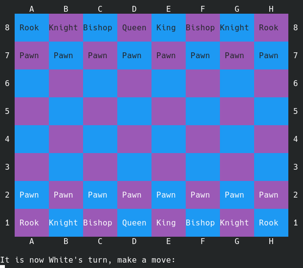

# Chess Game

## Introduction

This is a text-based Chess Game that was made as part of [The Odin Project](https://www.theodinproject.com), which is written in Ruby.

The project details can be found at [Project: Ruby Final Project](https://www.theodinproject.com/lessons/ruby-ruby-final-project).

For more details about the game, see [Chess](https://en.wikipedia.org/wiki/Chess)

## How to Play

Start the game by running:

```
ruby start_game.rb
```

Doing so will bring up the Main Menu:

```
                The Chess Game Main Menu

Here are the options that you can select:

  P - Play the game in 2-player mode
  W - Play the game against computer (you play white)
  B - Play the game against the computer (you play black)
  R - Reset the game board
  S - Save the current game
  L - Load an existing saved game
  Q - Quit the game
  E - Exit the game

Enter the letter of the option you that you would like.

Input is not case sensitive and only the first letter of
what you enter matters.

The first 3 options will use the same board, reset the game
first if you want to start fresh.

Q and E do the same thing
```

The 'Save the current game' and 'Load an existing saved game' options will write to and read from a json file respectively. These files will be found in the saved_games directory. If that directory does not exist, then it will automatically be created.

Selecting one of the first three options to play the game will load the instructions and the game board.

Instructions:

```
Welcome to this game of Chess!

Enter the move you want to make using Chess notation.
For example, if you want to move the pawn on E2 up to E4, enter the
following notation (input is case insensitive):

E2 E4

This is how all pieces on the board are moved, by entering the
starting location followed by the ending location.  This includes
moves that captures an opponent's piece and castling.

For castling, move the King over to the left or right 2 spaces,
then the Rook will automatically move as well.

For pawn promotions, you will be prompted to select what the new
piece will be.

You can also enter 'menu' to go back to the Main Menu.
```

Game Board:



Then just start entering moves in Chess Notation to play.

If one of the kings ends up in check, then the game will print 'Check!'. If a king cannot get out of check, then it is a Checkmate.

The game will end when either Checkmate or Stalemate happens. The player trapping the other king in a Checkmate wins. If a player cannot make any legal moves and is not in check, then the game ends in a Stalemate (tie game).

En Passant and Castling moves are supported in this game.
